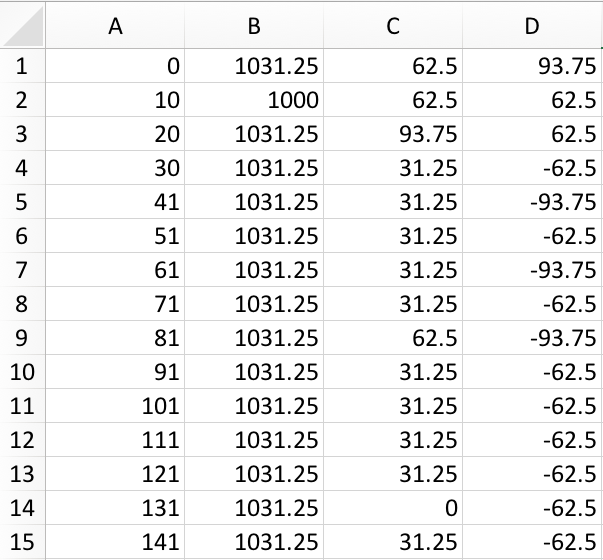

# MyoMag

MyoMag is a tool to read signals from an accelerometer via a csv file and calculate its magnitude in a fast and memory efficient way. The source code is written in C and it is additionally embedded in a Python environment PyMyomag.

## Data preparation

The signal's data is saved in a csv file without any header lines and in the format (time in millisecond, X Acc, Y Acc, Z Acc in milliG).

The csv file must be stored in the data folder of this directory.


## Getting Started

Git clone this repsoitory to the directory of your choice and run the Makefile:

```
make myomag
```


## Running the program

Use the terminal to run the program with

```

./myomag <filename> <nLines> <nSplits>

```
where the filename indicates the path to your CSV data file, nlines indicates the number of lines of the CSV file and nsplits indicates in how many parts the procedure is split to optimize the memory usage (additional comments on nSplit in Section: Notes on the source code).

e.g. the command can look like this 
```

./myomag "data/AccData.csv" 7024 5

```

to calculate the magnitude of signals, whose data is stored in the folder "data" with the filename "AccData.csv". The file contains 7024 lines(of signals data). Only 1/5 of the lines are read in and processed at once. This means the higher the nSplit number, the less memory is used.

The result is saved in the variable "magnitude_arr". 

If you want to call the function via a Python script then see the Section "Call the C- function with a Pyhton script" for further information.


## Definition of Done


Done is displayed, when Myomag read succesfully in the csv-file, processed the data and saved the value of the magnitude for each line (each time step) in the variable magnitude_arr.


## Call the C- function with a Pyhton script

It is possible to wrap the C-files of "myomag" into a package "PyMyomag" that can be called in a python script

e.g.

```

import PyMyomag


fileName = “Accdata.csv”

nlines = 7024

nsplits = 1

magnitude = PyMyomag(fileName, nlines, nsplits)

```

The above exampel is saved in PyMyomag_main.py file.

### Getting started to run myomag in Python

- Open the src file acc.c and uncomment the code in the lower part marked with the comment "Extension module".

- use the terminal, navigate to the src directory and install the package with:

```
sudo python setup.py install
```

The package will be installed and saved now in the site-packages folder of your python folder.

- Comment the “extension-module” part again in the acc.c file.


## Notes on the source code

- Myomag is written in C and embedded in a Python environment.

- The memory occupation is optimized by:
 -- Reading only a small number (1/nsplits) of records from the CSV file.
 -- Calculate their magnitude.
 -- Repeat until the entire file is processed.

	E.g. nSplits = 3 means that the program reads in only 1/3 of the csv data, calculates the magnitude and reuses the buffer for the next 1/3 of the data file.

- The C code is supported by the unittesting framework of [CUnit](http://cunit.sourceforge.net/). To run the tests, install first the package, by downloading it from their site and run the command:

```

make runtests

```
which compiles a testing environment for the "dataloader.c" and the "accelerationmagnitude.c" script.
```

./dataloader_test
./accelerationmagnitude_test

```


## Author


Ida Aichinger, April 2018
